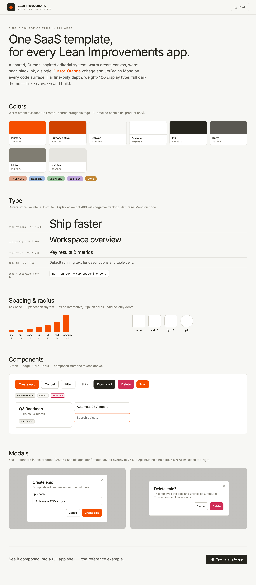
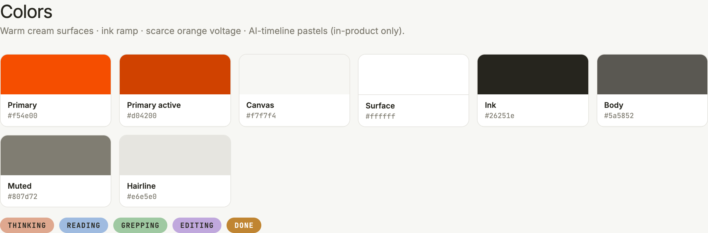
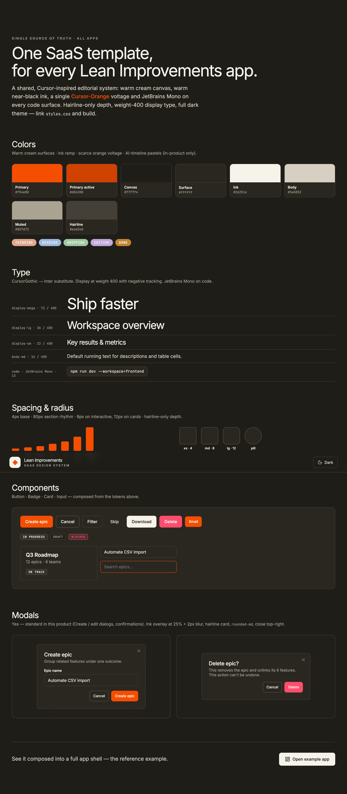
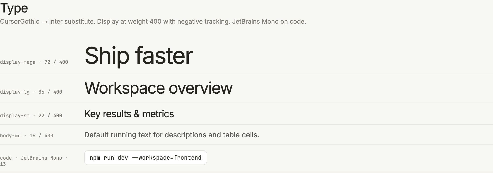
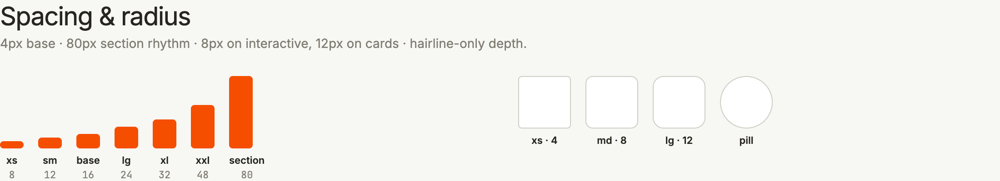
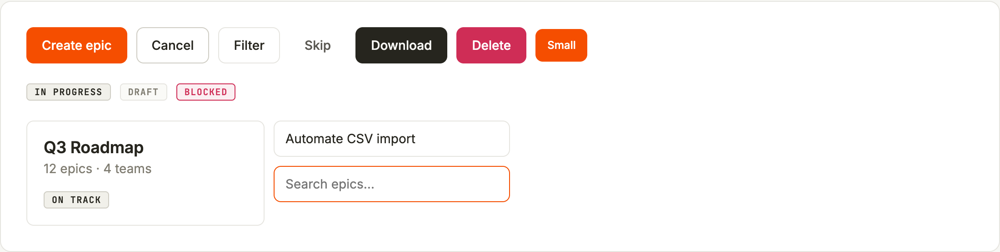
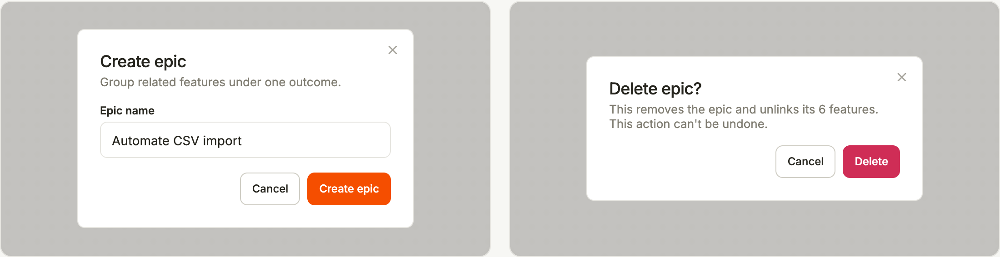
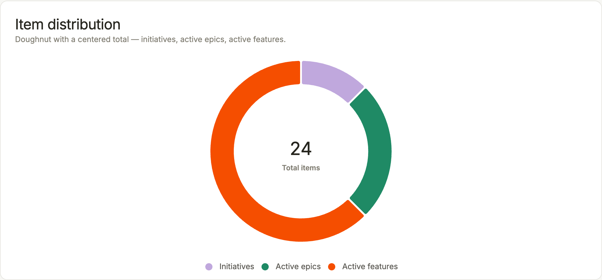
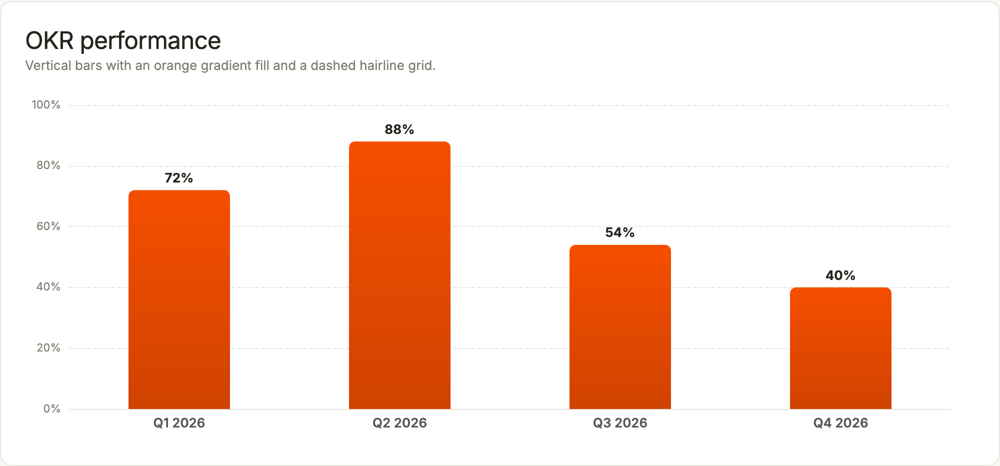
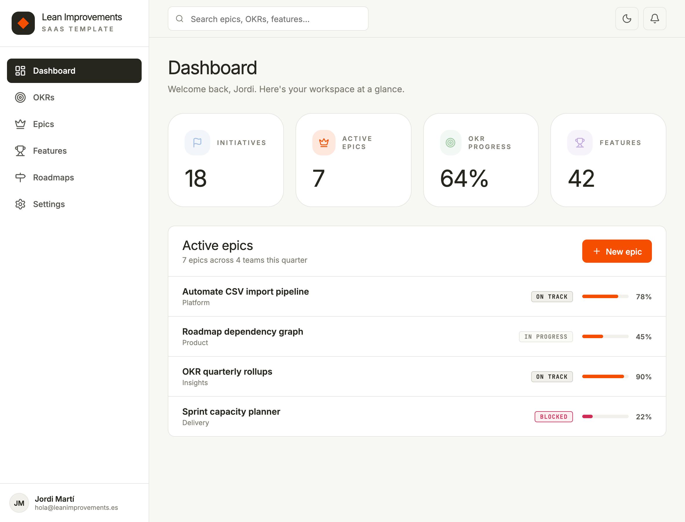

# Lean Improvements SaaS — Design System

[](./LICENSE)
[](https://lean-improvements.github.io/open-design-system-li/)
[](#distribution--install-straight-from-github-no-registry-no-token)

> The shared UI template for **every Lean Improvements app**. Warm cream canvas,
> warm near-black ink, a single Cursor-Orange voltage, and JetBrains Mono on every
> code surface.



This is the **single source of truth** for the look & feel of all products built by
**Lean Improvements** (Valencia, `leanimprovements.es`). Link `styles.css`, use the
components, follow the rules below, and any new app inherits the same editorial,
Cursor-inspired aesthetic out of the box.

---

## ▶ Live demo

Explore the whole system interactively (no install, runs in your browser):

- **Showcase** → **<https://lean-improvements.github.io/open-design-system-li/>** — colors, type, spacing, buttons, badges, cards, inputs, dialogs, with a live dark-mode toggle.
- **Reference app** → **<https://lean-improvements.github.io/open-design-system-li/ui_kits/saas-app/>** — the system composed into a full product surface (sidebar, stat counters, epics table).
- **Charts** → **<https://lean-improvements.github.io/open-design-system-li/charts.html>** — ECharts data-viz themed with the tokens (doughnut + bar).

---

## 🎨 Colors

Warm cream surfaces, an ink ramp for text, a **scarce** orange voltage, and a
five-step AI-timeline pastel set reserved strictly for in-product agent
visualizations.


| Token | Hex | Usage |
|---|---|---|
| `--lp-primary` | `#f54e00` | Brand voltage — primary CTA, brand diamond, focus ring, progress fill |
| `--lp-primary-active` | `#d04200` | Pressed/hover state of primary |
| `--lp-bg` | `#f7f7f4` | Warm cream canvas (never pure white floor) |
| `--lp-surface` | `#ffffff` | Cards / panels — lift off the cream by contrast, not shadow |
| `--lp-surface-alt` | `#f1f0ea` | Secondary surface, subtle fills |
| `--lp-ink` | `#26251e` | Warm near-black — body + display text |
| `--lp-body` | `#5a5852` | Running text |
| `--lp-muted` | `#807d72` | Captions, secondary labels |
| `--lp-line` | `#e6e5e0` | Hairline dividers (depth is 1px lines, `box-shadow` is `none`) |
| `--lp-success` / `--lp-error` | `#1f8a65` / `#cf2d56` | Semantic status |

**AI-timeline pastels** (in-product agent stages **only**, never general UI):




A full **dark theme** ships too (`.dark` → warm charcoal `#1f1d18`):



---

## 🔤 Type

One sans family — **CursorGothic** (licensed) → **Inter** substitute — plus
**JetBrains Mono** on every code surface. Display sits at **weight 400** with
negative tracking (a magazine voice, never bold).

| Role | Size | Weight | Tracking |
|---|---|---|---|
| display-mega | 72px | 400 | −0.04em |
| display-lg | 36px | 400 | −0.04em |
| display-md | 26px | 400 | −0.04em |
| display-sm | 22px | 400 | −0.04em |
| title-md / sm | 18 / 16px | 600 | — |
| body-md / sm | 16 / 14px | 400 | — |
| caption | 13px | 400 | — |
| eyebrow | 11px | 600 | 0.24em · UPPER |
| code (mono) | 13px | 400 | — |



---

## 📐 Spacing & radius

4px base unit, **80px section rhythm**, hairline-only depth.

| Spacing | px | | Radius | px |
|---|---|---|---|---|
| `--space-xs` | 8 | | `--radius-xs` | 4 (badges) |
| `--space-sm` | 12 | | `--radius-md` | 8 (buttons, inputs — default) |
| `--space-base` | 16 | | `--radius-lg` | 12 (cards) |
| `--space-lg` | 24 | | `--radius-xl` | 16 (rare) |
| `--space-xl` | 32 | | `--radius-pill` | 9999 |
| `--space-section` | 80 | | | |



---

## 🧩 Components

Composed from the tokens above — Buttons (default / secondary / outline / ghost /
ink / destructive + small), Badges, Card and Input:



**Dialogs** — ink overlay at 25% + 2px blur, hairline card, `rounded-md`, close top-right:



> These are design-reference primitives. Production components are **shadcn/ui**
> (Radix), themed with these tokens — the canonical code lives in each app's
> `src/components/ui/*`. See [Components — we use shadcn/ui](#components--we-use-shadcnui).

---

## 🔢 Counters & 📊 data-viz

Stats are **big display figures** with a tiny muted uppercase eyebrow above:


Charts in products use **[ECharts](https://echarts.apache.org)** themed with these
tokens — scarce Cursor-Orange voltage, warm neutrals, Inter/JetBrains-Mono type.
[▶ See the charts live](https://lean-improvements.github.io/open-design-system-li/charts.html):





The reference dashboard shows counters, a status table and progress bars together:



---

## Content fundamentals — how Lean Improvements apps write

- **Product UI language is bilingual (en / es)** via `react-i18next`; no strings
  are hard-coded. English is the reference (`en.json`), Spanish the peer (`es.json`).
- **Tone:** plain, operational, peer-to-peer. Labels are short nouns
  ("Dashboard", "Workspace", "Settings"); actions are imperative verbs
  ("Create", "Add to sprint", "Reservar diagnóstico").
- **Casing:** Sentence case for headings and body. **Eyebrows / panel labels are
  UPPERCASE** with wide `0.24em` tracking. Status badges are UPPERCASE mono.
- **Numbers carry weight:** stats are big display figures with a tiny muted
  uppercase label above. Progress as `%`.
- **Emoji:** never in product UI. The voice is clean and professional.

---

## Iconography

**[Lucide](https://lucide.dev)** is the icon system (apps use `lucide-react`).
Clean 1.5px-stroke line glyphs at 16–20px. **No emoji. No Unicode-character icons.**

The brand mark is a small **ink rounded square holding an orange diamond** — set
beside the **"Lean Improvements"** wordmark with a small uppercase eyebrow.

---

## Components — we use shadcn/ui

Production components are **[shadcn/ui](https://ui.shadcn.com)** (Radix UI
primitives), themed with the tokens in this system. shadcn is copy-paste, not a
versioned dependency — so the **canonical implementation lives in each app's repo**
(`src/components/ui/*`), and that is the source of truth for component code. The
`components/core/` files here are lightweight **design references / prototype
helpers**. When in doubt, the repo wins.

---

## Index — what's in here

- `styles.css` — global entry point (import this). `@import`s all tokens.
- `tokens/` — `fonts.css`, `colors.css`, `typography.css`, `spacing.css`, `base.css`.
- `components/core/` — design-reference primitives (Button, Badge, Card, Input, Dialog).
- `ui_kits/saas-app/` — the reference example app (sidebar + dashboard + dark-mode toggle).
- `guidelines/*.card.html` — foundation specimen cards (Colors / Type / Spacing / Brand).
- `index.html` — one-page visual preview of the whole system.
- `charts.html` — ECharts data-viz demo (doughnut + bar), brand-themed.
- `docs/screenshots/` — the images used in this README (regenerate with `npm run screenshots`).
- `SKILL.md` — Agent-Skill manifest for using this system in Claude Code.

---

## Preview locally — see it in the browser

```bash
npm install
npm run dev          # static server on http://localhost:4173
```

- `/` — one-page visual preview (`index.html`).
- `/ui_kits/saas-app/` — the reference example app.
- `/guidelines/` and `/components/core/` — the specimen cards.

Regenerate the README screenshots (drives your system Chrome, no browser download):

```bash
npm run screenshots  # writes docs/screenshots/*.png
```

---

## Distribution — install straight from GitHub (no registry, no token)

This is an **open-source (MIT)** package distributed **directly from this public Git
repo** — no npm registry, no `.npmrc`, no auth token. Because it ships raw source
(no build step), npm installs it straight from a tagged commit.

### Use it in a product

1. Add it to `package.json`, pinned to a release tag:
   ```jsonc
   {
     "dependencies": {
       "@lean-improvements/design-system": "github:Lean-Improvements/open-design-system-li#v1.0.0"
     }
   }
   ```
   Then `npm install`. (The package **name** stays `@lean-improvements/design-system`,
   so all imports below are unchanged — only the source is this Git repo.)

   > Installing a `github:` dependency requires **git** in the install environment.
   > Alpine CI/Docker images must `apk add --no-cache git` before `npm install` / `npm ci`.

2. Import the theme once in your app entry (`main.tsx`):
   ```ts
   import "@lean-improvements/design-system/styles.css";
   ```
3. Extend the Tailwind config with the shared preset:
   ```js
   import preset from "@lean-improvements/design-system/tailwind-preset";
   export default {
     presets: [preset],
     content: [
       "./src/**/*.{ts,tsx}",
       "./node_modules/@lean-improvements/design-system/**/*.{js,jsx}",
     ],
   };
   ```
4. Run `npx shadcn@latest init` (monorepo mode) and add components — they inherit
   the tokens automatically. Production component code stays in your app's
   `src/components/ui`.

To adopt a newer version, bump the tag in the Git URL (e.g. `#v1.1.0`).

### Publish a new version (in THIS repo)

Releases are automated with **[release-please](https://github.com/googleapis/release-please)**
and driven by [Conventional Commits](https://www.conventionalcommits.org/):

- `fix: …` → **patch** (token tweak / bug fix)
- `feat: …` → **minor** (additive token / component)
- `feat!: …` or a `BREAKING CHANGE:` footer → **major** (renamed/removed token or
  changed default — consumers must adapt)

On every push to `main`, release-please opens/updates a **"chore: release x.y.z"**
PR with the version bump + `CHANGELOG.md`. Merging that PR creates the git tag
`vX.Y.Z` and a GitHub Release automatically. No secrets required — it uses the
built-in `GITHUB_TOKEN`.

---

> **Substitution note:** CursorGothic is a licensed typeface and is **not** shipped
> here — the open substitute **Inter** is loaded from Google Fonts (with CursorGothic
> kept first in every `--font-*` stack). JetBrains Mono is the real production mono.
